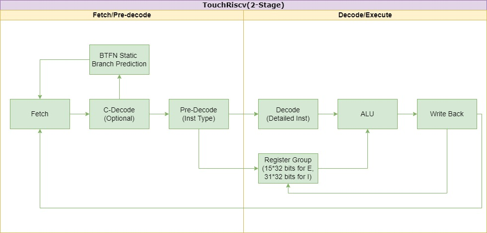
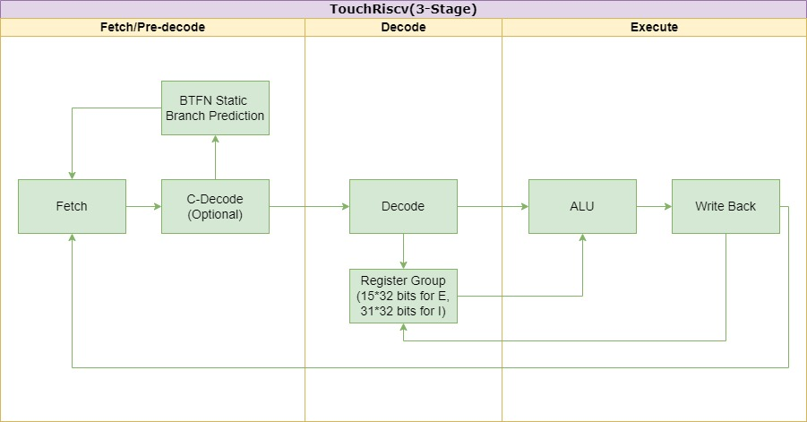

# TouchRiscv
A Tiny 2-stage/3-stage RV32E/I(C) core, based on SpinalHDL v1.7.2.It's just working for now.

## Features
* 32-bits Risc-V ISA Core.
* In-order 2 or 3 stage pipeline.
* Support RV32I/E(Basic integer instruction), optional C(Simplify instruction), Zicsr(CSR instruction).
* Basic tri-mode support for safety.
* TCM options.
* AHB-lite3 or AXI4-lite interface.

## Future Features
* Support RV32M(Integer multiplication and division instruction).
* Fine clock-based power consumption.

## Pipeline Design
2-stage config:

3-stage config:

More things just developing......